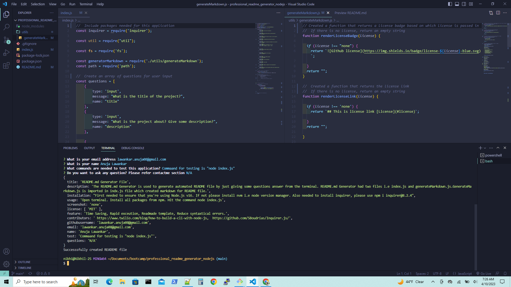
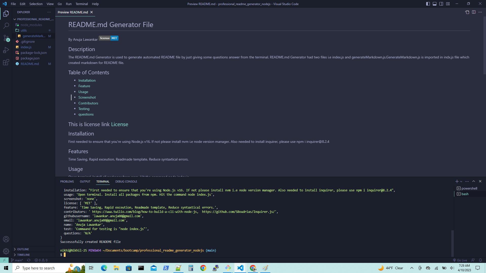
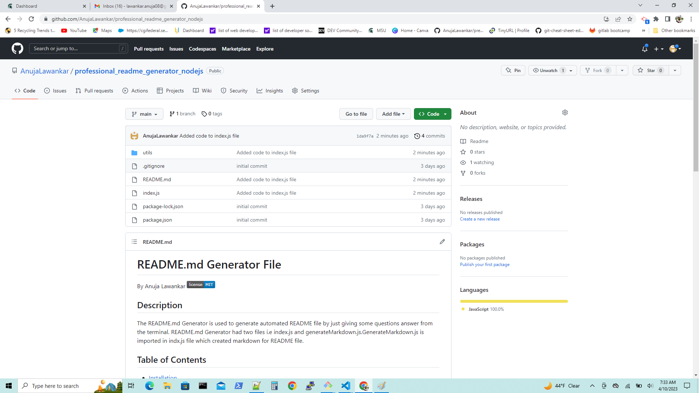
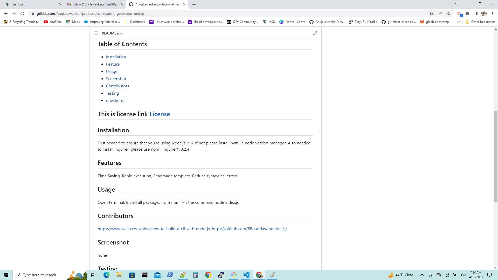

# README.md File Generator
 
  By Anuja Lawankar
 

 ## Description
  The README.md Generator is used to generate automated README file by just giving some questions answer from the terminal. README.md Generator had two files i.e index.js and generateMarkdown.js.GenerateMarkdown.js is imported in indx.js file which created markdown for README file.

 ## Table of Contents

 *  [Installation](#installation)
 *  [Feature](#feature)
 *  [Usage](#usage)
 *  [Screenshot](#screenshot)
 *  [Contributors](#contributors)
 *  [Testing](#testing)
 *  [questions](#questions)

 ## This is license link [License](#license)
 

## Installation
First needed to ensure that you're using Node.js v16. If not please install nvm i.e node version manager. Also needed to install inquirer, please use npm i inquirer@8.2.4
 
 ## Features
 Time Saving, Rapid execution, Readymade template, Reduce syntactical errors.

 ## Usage
  Open terminal, Install npm package, hit command node index.js

 ## Contributors
 https://www.twilio.com/blog/how-to-build-a-cli-with-node-js,  https://github.com/SBoudrias/Inquirer.js/

## Screenshot with Uploaded link of a walkthrough video 
    Link of walkthrough video https://drive.google.com/file/d/1VH59f1fVCYLRk9fj7--wp6AHHtQYC4yo/view

## Testing
Command for testing is "node index.js"

## Contact-Me
* Name - Anuja Lawankar
* Email -lawankar.anuja08@gmail.com
* GitHub - [lawankar.anuja08@gmail.com](https://github.com/lawankar.anuja08@gmail.com/)

## Ask Questions
N/A

## License

    License under the MIT license
  